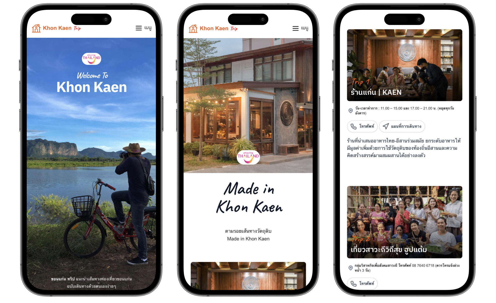

ในชุมชนท่องเที่ยว มีคำถามซ้ำ ๆ ที่เกิดขึ้นบ่อยมาก

"ไปเที่ยวไหนได้บ้าง" "กินข้าวที่ไหนดี" "เส้นทางไหนน่าแวะ"

คนในพื้นที่รู้คำตอบ แต่ไม่ใช่ทุกคนจะตอบได้ทันที ข้อมูลส่วนใหญ่อยู่ในความทรงจำ ในการบอกปากต่อปาก ในประสบการณ์ของคนที่อยู่มานาน แต่ยังไม่ถูกจัดวางให้คนนอกเข้าถึงได้ง่าย

โจทย์นี้ไม่ได้เกิดเฉพาะที่ใดที่หนึ่ง หลายชุมชนท่องเที่ยวทั่วประเทศเจอปัญหาคล้ายกัน

คำถามที่ตามมาคือ ถ้าเราสร้างกระบวนการรวบรวมข้อมูลชุมชนให้เป็นระบบ แล้วทำให้มันเป็นต้นแบบที่จับต้องได้ มันจะเป็นแนวทางที่ชุมชนอื่น ๆ นำไปทดลองต่อได้ไหม

## ต้นแบบที่ภูผาม่าน

[เทคไทบ้าน](https://techthaiban.org)พยายามทำเรื่องนี้มาสักพักแล้ว

[บทความก่อนหน้า](/blog/community-platform-ai/) เราเล่าถึงความพยายามที่ภูผาม่าน ตั้งแต่ปี 2565 ที่เราเริ่มเก็บข้อมูลชุมชนอย่างเป็นระบบ สร้างเว็บไซต์ ทำ QR Code ตั้งไว้ที่ร้าน เพื่อให้คนมาเที่ยวค้นหาข้อมูลได้ด้วยตนเอง

ตอนนั้นเราตั้งคำถามว่า ถ้าความรู้ที่มีอยู่แล้วในชุมชนถูกจัดวางให้คนนอกเข้าใจได้ มันจะเปลี่ยนประสบการณ์ของนักเดินทางได้แค่ไหน และถ้ากระบวนการแบบนี้ทำซ้ำได้ มันอาจเป็นไอเดียให้ชุมชนอื่น ๆ เอาไปลองต่อ

## ขอนแก่น ทริป

ททท. สำนักงานขอนแก่นมองเห็นแนวทางนี้ และชวนเทคไทบ้านมาต่อยอดกลไกเดียวกันกับเส้นทางท่องเที่ยวของขอนแก่น ภายใต้แคมเปญ **Made in Khon Kaen** แนวคิดหลักคือ "ตามรอยเส้นทางวัตถุดิบ" ให้นักเดินทางออกสำรวจชุมชนได้ด้วยตัวเอง

ขอนแก่นมีชุมชนดี ๆ กระจายอยู่หลายอำเภอ มีเรื่องราว มีวัตถุดิบ มีผู้คน แต่ข้อมูลยังไม่มีที่รวมให้ค้นหาได้ในทีเดียว ถ้าไม่รู้จักใครในพื้นที่ ก็ยากจะรู้ว่าจะเริ่มต้นจากตรงไหน

จนกลายมาเป็น [khonkaentrip.com](https://khonkaentrip.com)

แพลตฟอร์มออกแบบมาให้ชุมชนสามารถเพิ่มข้อมูลเส้นทางท่องเที่ยวของตัวเองได้โดยตรง นักเดินทางที่เข้ามาก็วางแผน Road Trip ได้ด้วยตนเอง โดยไม่ต้องรู้จักใครในพื้นที่ก่อน

## ทดสอบในงาน Taste of Kaen

การทดสอบจริงเกิดขึ้นในงาน **Taste of Kaen** วันที่ 20–21 มิถุนายน 2567 กิจกรรมวันแรกเริ่มต้นด้วยมื้อ Fine Dining ที่ร้านแก่น ร้านอาหารอีสานที่ติดมิชลินไกด์สองปีซ้อน เชฟไพศาลและเชฟจิ๊บรังสรรค์ Tasting Menu จากวัตถุดิบ 8 ชุมชน แต่ละเมนูมี QR Code ให้แขกสแกนตามรอยกลับไปดูข้อมูลชุมชนบนเว็บไซต์ได้เลยระหว่างกิน ผู้ผลิตทุกคนถูกแนะนำในชื่อของตัวเอง ไม่ใช่แค่แหล่งวัตถุดิบที่ไม่มีชื่อ

วันสองพาสื่อมวลชนและ Influencer ออก Day Trip ตามรอยชุมชน ล่องเรือแก่งละว้า เยือนวัดไชยศรี ทำ Workshop ศิลปะกับ SIRI ก่อนมาจบที่ห้องอาหาร Food by Fire บนโรงแรมแอดลิบที่มองเห็นวิวเมืองมุมสูง

*อ่านรายละเอียดงาน Taste of Kaen ฉบับเต็มที่ <a href="https://readthecloud.com/art-and-culture/scoop/tasting-menu-made-in-khon-kaen/" target="_blank" rel="noopener noreferrer">The Cloud</a>*

## สิ่งที่เทคไทบ้านเรียนรู้จากกระบวนการนี้

บทเรียนแรกคือเรื่องของภาคีและการขยายผล

เมื่อก่อนเราทำงานกับชุมชนโดยตรง ซึ่งดี แต่ก็มีขีดจำกัดในแง่ของการเข้าถึง การที่ ททท. สำนักงานขอนแก่นมองเห็นกลไกนี้และชวนมาต่อยอด ทำให้เราเข้าใจว่าถ้ากระบวนการเก็บข้อมูลชุมชนมีความชัดเจนพอ มันสามารถเดินทางไปกับหน่วยงานและภาคีที่มีเครือข่ายอยู่แล้วได้

ไม่ต้องสร้างทุกอย่างใหม่ทุกครั้ง

บทเรียนที่สองคือเรื่องของเวลาและบริบท

การทดสอบในงาน Taste of Kaen สอนให้เรารู้ว่า ข้อมูลชุมชนที่ดีไม่จำเป็นต้องรอให้คนมาหาบนเว็บไซต์ มันสามารถไปอยู่ในบริบทที่คนกำลังสนใจอยู่แล้ว เช่น ระหว่างมื้ออาหาร ระหว่างเดินทาง ระหว่างที่ประสบการณ์กำลังเกิดขึ้น

QR ที่สแกนได้ระหว่างกินอาหาร ไม่ใช่แค่ลิงก์ แต่คือช่องทางที่เชื่อมประสบการณ์เข้ากับที่มา

และนั่นคือสิ่งที่เราอยากนำกลับไปทดลองต่อที่ภูผาม่าน ว่าถ้าชุมชนมี Platform เป็นของตัวเอง และมีภาคีที่เชื่อมบริบทการใช้งานเข้าด้วยกัน กระบวนการแบบนี้จะยืนได้ด้วยตัวเองหรือเปล่า

สิ่งที่เราสังเกตเห็นจากสื่อมวลชนและนักสร้างสรรค์ใน Day Trip วันที่สองก็น่าสนใจไม่แพ้กัน เมื่อพวกเขาเดินเข้าชุมชนพร้อมฐานข้อมูลที่จัดระเบียบแล้ว วิธีที่พวกเขาตั้งคำถามเปลี่ยนไป จากการรับข้อมูลแบบ passive กลายเป็นการสำรวจแบบ active ข้อมูลไม่ได้แทนที่ประสบการณ์ตรง แต่ทำให้ประสบการณ์นั้นมีจุดตั้งต้นที่ชัดขึ้น

---

สิ่งที่เราพยายามพิสูจน์ตลอดมาไม่ใช่เรื่องของ Platform

แต่คือคำถามข้อหนึ่ง

> ป็นไปได้ไหมที่ผู้คนในชุมชน จะเข้าถึงเครื่องมือทางเทคโนโลยี และใช้มันจัดการความรู้ของตัวเองได้

KhonkaenTrip ยังไม่ใช่คำตอบสุดท้าย แต่เป็นหลักฐานว่ามันเริ่มต้นได้

---

ขอบคุณ ททท. สำนักงานขอนแก่น และภาคีเครือข่ายทุกท่านที่ชวนกันทำให้กลไกนี้เกิดขึ้นได้จริง

ปัจจุบัน [khonkaentrip.com](https://khonkaentrip.com) ยังคงเปิดใช้งานอยู่ และชุมชนต่าง ๆ ยังสามารถเพิ่มเส้นทางท่องเที่ยวใหม่ได้อย่างต่อเนื่อง

และสิ่งที่เราเรียนรู้จากขอนแก่น กำลังถูกนำกลับไปต่อยอดที่ภูผาม่าน จุดเริ่มต้นของคำถามนี้ครั้งแรก การพัฒนาแพลตฟอร์มท่องเที่ยวชุมชนครั้งใหม่คงสนุกน่าดูเมื่อมีเครื่องมือ AI เข้ามาช่วย
